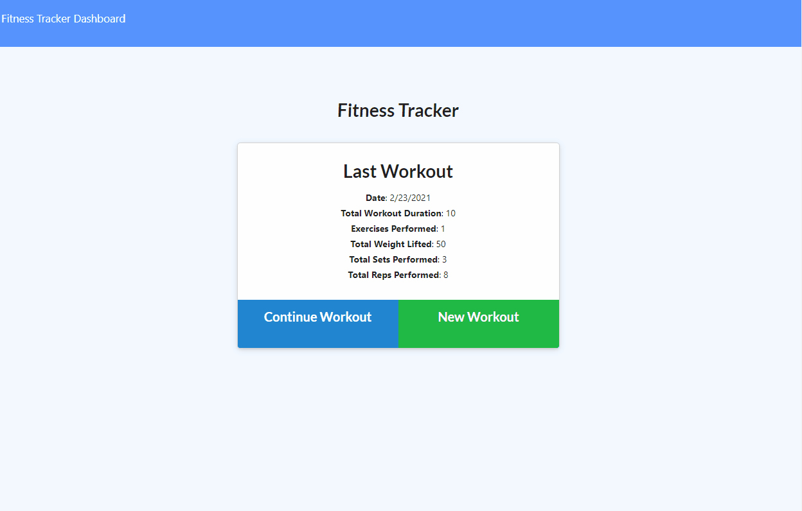

# Bootcamp Homework 17 - NoSQL: Workout Tracker

## Description
This is a coding bootcamp homework assignment to create a workout tracker.  This assignment required the creation of a Mongo database with a Mongoose schema and routes handling with Express - the front end code was provided.  

## Table of Contents
* [Usage](#Usage)
* [Contributing](#Contributing)
* [Questions](#Questions)
* [License](#License)

## Usage
The [Workout Tracker](https://vast-castle-24875.herokuapp.com/) application runs in the browser.

Enter a new workout or continue the most recent workout.  The app will display your most recent workout data.  A dashboard displays workout totals for the past 7 workouts

## Contributing
Fork the repo and submit a pull request to enhance the code or fix a bug

## Questions
Have questions?  Contact me on [GitHub](https://github.com/thorgriffs) or email <22.kelliking@gmail.com>

## License

[MIT](https://github.com/thorgriffs/workout-tracker/blob/main/LICENSE) License

Copyright (c) 2021 Kelli King